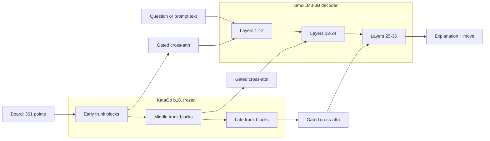
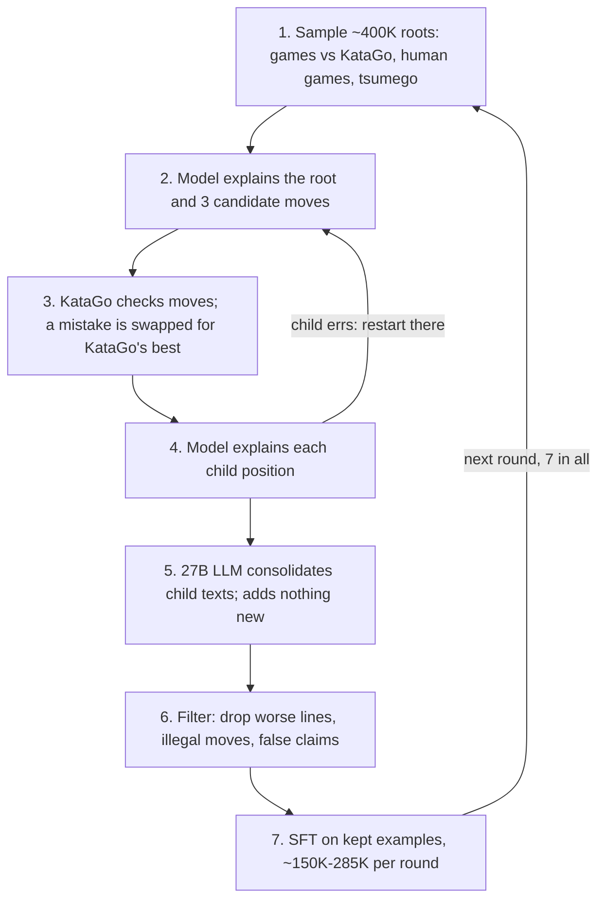

# Go-Queen: Language Models that Play Go and Explain Their Moves

Design doc, 2026-10-07. Live version (with comments):
https://claude.ai/code/artifact/395758c2-5ee5-44da-bc9d-cfa6d61d7f36

## Summary

We can port Queen to Go for about $10K, if we keep the chess recipe and spend in gated phases. The goal is a ~4B model that plays strong Go and explains each move in plain English.

Queen joins a silent engine net (Lc0) to a small instruction-tuned LM (SmolLM3-3B) with gated cross-attention. It then teaches the LM to read the engine through a four-stage QA curriculum and seven rounds of self-distillation. It went from 1782 to 2697 Elo. For Go we swap Lc0 for KataGo, Stockfish for KataGo search, and Lichess for public Go game archives. The rest of the recipe stays the same.

The paper does not report its compute, so the costs here are estimates. A replication at Queen's own data scale (same model size, 7 rounds, ~400K roots per round) costs roughly $5.8K–$6.8K of GPU time and API calls; the rest is reserve. The first $1.5K answers the key question: can the LM learn to read the KataGo encoder at all?

## What Queen did

Queen ([paper](https://arxiv.org/abs/2610.03695), [code](https://github.com/queen-project/queen), [project page](https://queen-project.github.io/)) reached an estimated 2697 Elo with 68.8% no-mistake lines on tactical puzzles. Frontier LLMs scored 1822–2201 Elo.

| Part | What Queen used |
| --- | --- |
| Encoder | Lc0 BT5: 240M params, 15 layers, 64 square tokens |
| Decoder | SmolLM3-3B, 36 layers |
| Bridge | Flamingo-style gated cross-attention; encoder layer i feeds decoder layer 2i; ~470M trainable params |
| Tokens | New tokens for 64 squares and 12 piece types |
| Curriculum | 4 stages of QA, answers made and checked by program; earlier stages replayed at low rates |
| Seed data | 15K positions sent to GPT-5.6-Sol; 8,602 kept after legality and ≤10% win-rate-drop checks |
| Distillation | 7 rounds; ~400K roots sampled per round; 150K–285K examples kept |
| Oracle | Stockfish; a "mistake" is a win-rate drop of 10% or more |
| Consolidation | Qwen3.8-27B merges three child explanations, told to add nothing new |
| Elo eval | 32 games against 8 engines (Stockfish 10–3,000 nodes, Lc0 at 10K nodes) |

The distillation step is a natural-language Bellman update. The model explains a position by proposing three moves, then explains each child position. A larger LLM merges the child texts into a better parent text, and the model trains on that. Each round, the root explanation holds what the model learned one ply deeper.

## Chess to Go

Most parts map one to one. Three things make Go harder: longer games, strategy explanations that no program can check, and frontier LLMs that know less Go than chess.

| Part | Chess (Queen) | Go (this plan) |
| --- | --- | --- |
| Engine net | Lc0 BT5 (transformer) | KataGo b18 net (residual CNN), frozen |
| Board tokens | 64 squares | 361 points |
| Oracle search | Stockfish | KataGo search at high visit counts |
| Mistake test | Win-rate drop ≥10% | Win-rate drop ≥10% OR score-lead drop ≥2 points (to tune) |
| Extra checks | Legal moves | Legal moves, plus ownership-map checks on "this group is dead" or "this area is Black's" |
| Games | Lichess | KGS archive, OGS, Fox (licences to check) |
| Puzzles | Lichess puzzles | Tsumego from open sets, plus positions KataGo labels as sharp |
| Rules | Fixed | Chinese (area) scoring, komi 7.5, 19×19 only |
| Game length | ~80 moves | ~250 moves, so Elo games cost about 3× more |

KataGo's ownership head lets a program check many strategic claims (life and death, who owns a region). Claims about influence, thickness or direction of play still cannot be checked; the consolidation step must not invent them.

## Architecture

The LM reads a frozen KataGo net through a trained bridge. Each group of KataGo trunk blocks feeds a group of decoder layers through gated cross-attention, so the LM sees the board at several depths.

- **Encoder.** KataGo b18, frozen. It is already superhuman and cheaper than b28. A linear layer maps each point's channel vector to the decoder width.
- **Decoder.** SmolLM3-3B, as in Queen. Open, instruction-tuned, knows little Go.
- **Bridge.** Flamingo-style gated cross-attention layers between decoder layers. Gates start at zero, so the LM starts unchanged.
- **Tokens.** 361 point tokens and 2 stone tokens, so "Q16" is always one token.

## Curriculum

Queen's four stages, with Go tasks. A Go rules engine makes and checks every answer, so this data costs only CPU time. Each task gets three question/answer formats.

| Stage | Go tasks | Answer checked by |
| --- | --- | --- |
| 1. Static, now | Stone at a point; all Black or White stones; stone counts; captured-stone counts; whose turn; groups and their sizes | Board state |
| 2. Dynamic, now | Liberties of a group; groups in atari; legal moves; captures a move makes; ko and suicide; a move that ataris | Rules engine |
| 3. Static, future | Play a given line, then answer any stage 1 question | Rules engine replay |
| 4. Dynamic, future | Play a given line, then answer any stage 2 question; ladder works or fails; who wins a capturing race | Rules engine, plus a ladder solver and a small race solver |

Points use GTP names (A1–T19, no I). Lines run 1–12 moves. Positions come from the same game and puzzle pools as the distillation step. Target size: about 2M QA pairs (a guess; stop a stage early when held-out accuracy flattens).

## Distillation loop

Queen's loop as is, with KataGo as the oracle.

Go-specific changes:

- **Seed data.** Frontier LLMs are weaker at Go than chess. The seed prompt gives KataGo's top moves, lines and ownership map, and the LLM only explains them. Target: ~9K kept examples from 15K positions.
- **Mistake test.** Win rate drops ≥10% or score lead drops ≥2 points. The score test catches errors in games already won or lost.
- **Filter.** Besides comparing lines with KataGo, check every claim a program can check: liberties, captures, ladders, and life and death against the ownership map. Drop examples with a false claim.

Consolidation can use an open 27B model on our GPUs or an API; choose after a cost test in round 1.

## Evaluation

- **Strength (Elo).** 32 games against a ladder of 8 KataGo opponents at fixed visits (e.g. 1, 4, 16, 64, 256, 1K, 4K, 16K). Anchor to human ranks with KataGo's human-imitation net at known ranks.
- **Substantiation.** 1,000 held-out tsumego and 1,000 general positions. Report no-mistake rate (NMR) over the predicted line and first-move no-mistake rate (FNMR). Oracle: KataGo at ~100K visits.
- **Claim accuracy (new).** Share of checkable claims that are true: liberties, atari, captures, ladders, life-and-death and ownership claims.
- **Coherence.** Frontier LLM judge on a Likert scale: structure, concepts, fluency.

Baselines: frontier LLMs with high reasoning budgets, the raw KataGo policy net (ceiling for what the encoder knows), our round 0 model.

## Budget

At an assumed ~$2.50 per H100-hour on demand, $10K buys about 4,000 H100-hours.

| Item | Basis | H100-hours | Cost (USD) |
| --- | --- | --- | --- |
| Distillation, 7 rounds | Per round: ~80 h generation, ~50 h consolidation (open 27B), ~25 h KataGo checks, ~10 h training, ~10 h Elo games | ~1,225 | ~3,100 |
| Development, smoke tests, failed runs | One round's worth of waste, twice | ~600 | ~1,500 |
| Seed explanations | 15K positions to a frontier API, KataGo analysis in the prompt | — | 500–1,500 |
| Final eval | Elo ladder, 2K held-out positions, LLM judge | ~40 | ~300 |
| Curriculum SFT | ~2M QA pairs, ~0.8B tokens, plus ablations | ~100 | ~250 |
| QA data, game parsing | CPU only | — | ~100 |
| Round 0 SFT on seed data | ~9K examples | ~10 | ~25 |
| **Total** | | **~2,000** | **~5,800–6,800** |

If money runs short, sample 200K roots per round instead of 400K; that halves the round cost.

## Risks and open questions

| Risk | Effect | Fallback |
| --- | --- | --- |
| CNN features are hard to read through cross-attention | Curriculum accuracy stalls | Small transformer adapter over KataGo trunk features; or train the bridge longer before unfreezing the LM |
| Frontier LLMs explain Go badly | Weak seed data, slow round 1 | Put KataGo's top moves, lines and ownership in the prompt; the LLM only writes words around checked facts |
| Strategy claims cannot be checked | Model learns confident nonsense about influence | Score only checkable claims; consolidator drops unchecked claims |
| 361 tokens per layer costs more than 64 | Slower training and inference | Pool to fewer tokens in early layers; keep all 361 in late layers |
| Win rate is flat in won or lost games | 10% mistake test misses errors | Add a score-lead test |
| Game data licences | Cannot release data | Use OGS and KGS (research use to confirm); avoid paid sets such as GoGoD |
| Cost estimates are wrong | Budget runs out mid-run | Gates per phase; shrink roots per round |

Open questions:

- Decided: KataGo b18.
- Which trunk blocks pair with which decoder layers? Queen paired encoder layer i with decoder layer 2i; KataGo has a different depth.
- Should the model also see KataGo's policy and value outputs, or only trunk features?

## Milestones

Phase 1 decides whether the rest of the money is spent. Each gate must pass before the next phase spends money.

| Phase | Work | Cost | Gate to pass before the next phase |
| --- | --- | --- | --- |
| 0. Tooling | Rules engine, QA generator, KataGo wrapper, game and tsumego pools; CPU only | ~$100 | QA answers agree with a second Go engine on 10K samples |
| 1. Bridge and curriculum | Train the bridge on the 4 QA stages; test block-to-layer pairing | ~$1,400 | **Key gate:** held-out QA ≥95% on stages 1–2 and ≥80% on stages 3–4 |
| 2. Seed data and round 0 | 15K KataGo-grounded seed prompts; SFT; first Elo ladder | ~$1,500 | ≥99% legal moves, Elo measured, most checkable claims true |
| 3. Rounds 1–3 | Full loop; cost test of open 27B vs API for consolidation | ~$1,500 | Elo rises every round; if not, fix before spending more |
| 4. Rounds 4–7 and final eval | Remaining rounds; full eval | ~$2,000 | — |

Next steps:

- [ ] Confirm the KataGo net and its licence for research use
- [ ] Confirm KGS and OGS data terms
- [ ] Build the Go rules engine and the stage 1–2 QA generator (Phase 0)
- [ ] Pick a GPU provider and check the real H100 price
